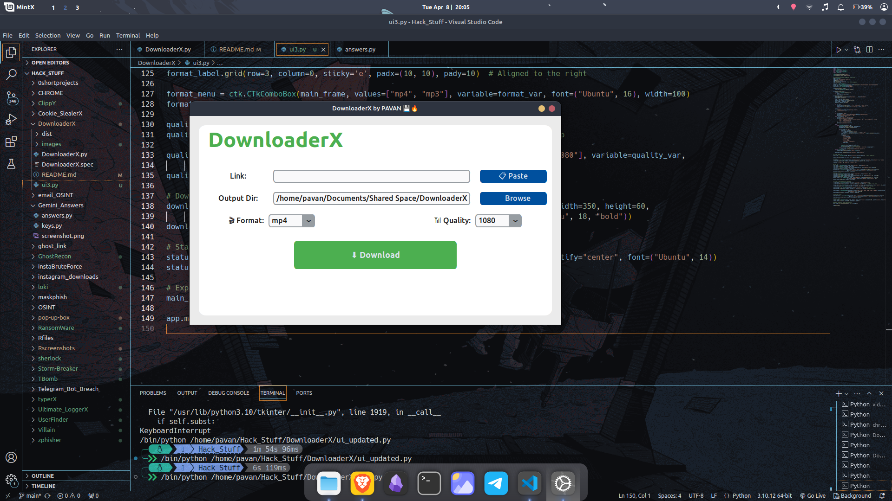
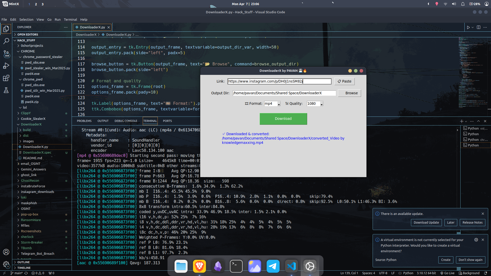

# gui tool to download instagram, Youtube and X videos (i mean twitter)

##install libraries/modules
```
pip install customtkinter
pip install yt-dlp
pip install pyperclip
```


##export to exe
```
pyinstaller --onefile --noconsole --icon=app.ico your_script_name.py
```



old versions
